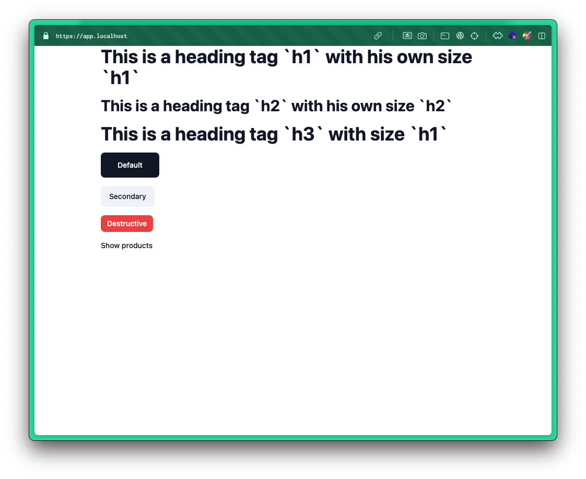

# Symfony with Tailwind and Twig Components

This project is a demonstration of using Tailwind CSS with Twig Components in a Symfony monolith project.


## Prerequisites

- Docker
- Make

## Starting the project

1. Clone the repository:

    ```bash
    git clone https://github.com/ErwannRousseau/symfony-tailwind-twig-components
    cd symfony-tailwind-twig-components
    ```

2. Build and start the Docker container:

    ```bash
    make start
    ```

3. Access the application in your browser at [https://app.localhost](https://app.localhost).

### Docker

This project is based on Docker with frankenphp.
You can find more information on the repo I based myself on, just here: [dunglas/symfony-docker: A Docker-based installer and runtime for Symfony. Install: download and `docker compose up`.](https://github.com/dunglas/symfony-docker)
